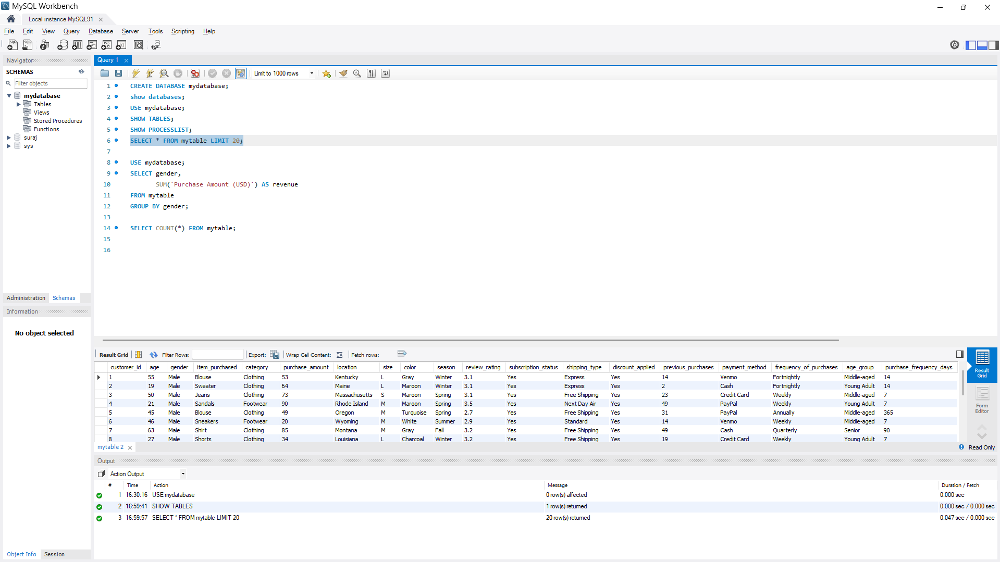

Customer Behaviour Data Analytics Project
End-to-End Data Analytics Pipeline (Python + MySQL + Power BI)

This project demonstrates a complete end-to-end data analytics workflow, starting from data cleaning in Python to visualization in Power BI.

📌 Project Overview
The objective of this project is to analyze customer shopping behavior and generate meaningful business insights using a structured data analytics pipeline.

This project covers:
Data cleaning and preprocessing in Jupyter Notebook
Database integration using MySQL
SQL-based analysis
Interactive dashboard creation in Power BI

🛠️ Technologies Used
Python (Pandas, SQLAlchemy, PyMySQL)
Jupyter Notebook
MySQL
Power BI
GitHub for version control

🔄 Project Workflow
1️⃣ Data Cleaning (Jupyter Notebook)
Loaded raw CSV dataset
Handled missing values
Created new derived columns:
Age Group (using quantiles)
Purchase Frequency (converted to days)
Standardized column names
Prepared dataset for SQL storage

2️⃣ Database Integration (MySQL)
Created database in MySQL
Connected Python to MySQL using SQLAlchemy
Pushed cleaned dataset using df.to_sql()
Verified data integrity using SQL queries

3️⃣ SQL Analysis

Performed business-level queries such as:
Revenue by Category
Revenue by Gender
Sales by Age Group
Customer segmentation insights

4️⃣ Data Visualization (Power BI)
Built an interactive dashboard including:
Average Purchase Amount KPI
Average Review Rating KPI
Total Number of Customers
Revenue by Category
Sales by Category
Revenue by Age Group
Subscription Status Distribution

Dashboard includes slicers for:
Gender
Category
Subscription Status
Shipping Type

📊 Key Insights
Clothing category generates highest revenue
Majority of customers are non-subscribers
Young adults contribute significantly to revenue
Average review rating is 3.75

📷 Project Screenshots Included

Jupyter data cleaning process
## 📷 Jupyter Work

## 🗄️ MySQL Connection

## 📊 Power BI Dashboard

🚀 Project Outcome
This project demonstrates a complete real-world data analyst workflow:
Python → MySQL → SQL → Power BI → Business Insights
It reflects practical skills in:
Data cleaning
Database management
Query writing
Dashboard development

